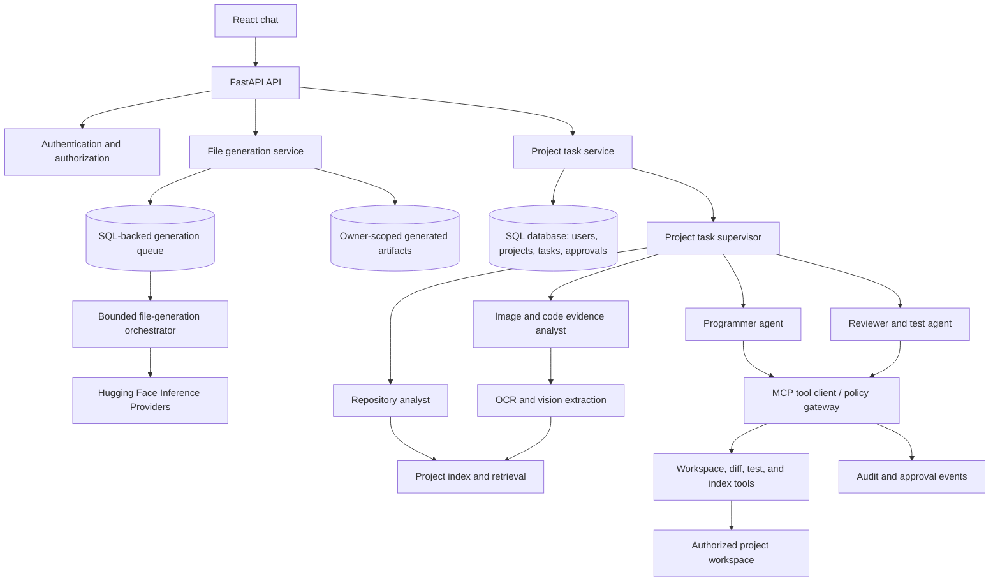
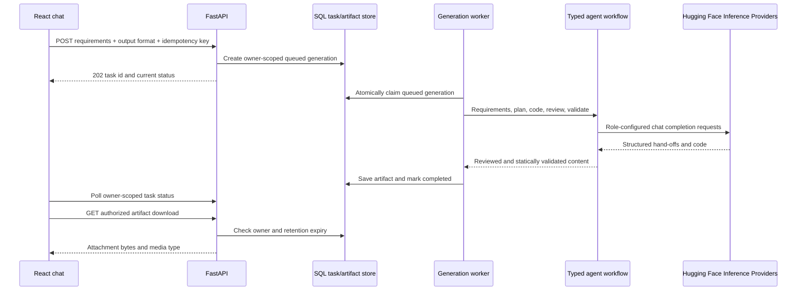

# Target Architecture

## System Boundary

FastAPI remains the public API. It authenticates the user, validates requests, persists task state, and invokes application services. The React client offers two distinct flows: standalone file generation from requirements and project-aware task work. Standalone generation does not require a project or expose filesystem tools; project tasks remain constrained to an authorized project root.

### Standalone Hugging Face File Generation

The standalone workflow turns one authenticated requirements request and selected output format into one downloadable artifact. It is independent of project registration, repository retrieval, MCP, and the project-change approval flow.

The Hugging Face adapter uses [`huggingface_hub.AsyncInferenceClient`](https://huggingface.co/docs/huggingface_hub/en/package_reference/inference_client) and its chat-completion API with the configured [Inference Provider](https://huggingface.co/docs/inference-providers/en/index) policy (default `auto`). `HF_TOKEN` stays on the server. A default model ID can be overridden per requirements analyst, planner, programmer, reviewer, or validator. No model identifiers or credentials are accepted from the browser.

The generation state is persisted independently of `DeveloperTask`. API submission creates an idempotent owner-scoped row; an application worker claims queued rows with a lease, updates the active stage, and recovers stale leases. Generated bytes and metadata are stored by owner and generation ID, have a configured expiry, and are available only through an authenticated download route. A clarifying question, cancellation, retry, and provider/configuration failure are explicit states.

Agents use typed JSON hand-offs in a deterministic order:

1. Requirements analyst asks a concise clarification question if a critical detail is missing.
2. File planner fixes the one-file scope, language, acceptance criteria, and a filename suggestion.
3. Programmer writes the complete file contents for the selected format.
4. Reviewer approves or gives focused feedback in a bounded revision loop.
5. Validator checks output against the criteria; deterministic checks additionally parse JSON and Python syntax. Generated programs are never executed.

Model output is untrusted data. Filenames are reduced to a sanitized basename with the selected extension; model-supplied paths are never used. The worker imposes request, output, timeout, and revision limits. Model failures are recorded without exposing credentials or raw provider responses.

## Components and Responsibilities

### Client (`Face/`)

- The standalone chat submits requirements plus one of the supported output formats and displays persisted generation history, current stage, clarification requests, failure/retry/cancel controls, and authenticated downloads.
- The project-task UI separately provides project selection, image attachment, task status, diff review, and approve/reject actions.
- Send images as multipart uploads or pre-authorized object references; do not place image bytes or secrets in prompts or browser logs.
- Display task events from polling initially; add server-sent events or WebSockets only when task runtime needs streaming.
- Keep auth behavior aligned with the backend contract; model IDs and Hugging Face tokens are never client inputs.

### FastAPI API (`brain/api/`)

Own request validation, authentication dependencies, upload limits, project/task authorization, stable response schemas, and HTTP error mapping. API handlers should remain thin and call services rather than constructing agents or tools directly.

Implemented routes:

- `POST /api/auth/register`, `POST /api/auth/login`, and `GET /api/auth/me`.
- `POST /api/projects` and `GET /api/projects`.
- `POST /api/tasks`, `GET /api/tasks`, and `GET /api/tasks/{task_id}`.
- `POST /api/tasks/{task_id}/changes/{change_id}/approval` to approve or reject a hash-bound proposal.
- `POST /api/files/generate` to enqueue a standalone file-generation task.
- `GET /api/files` and `GET /api/files/{generation_id}` to list/read only the authenticated user's generations.
- `POST /api/files/{generation_id}/clarification`, `POST /api/files/{generation_id}/retry`, and `DELETE /api/files/{generation_id}` for explicit task-state actions.
- `GET /api/files/{generation_id}/download` to return an unexpired, owner-authorized artifact.

Routes verify ownership. A project's relative path is resolved inside `PROJECTS_ROOT/user-<owner-id>/`; the browser cannot submit an absolute root. Index refresh, event streaming, cancellation, and independent diff routes remain future work.

### Developer Task Service (`brain/services/`)

The current task service owns prompt/context assembly and invokes the supervisor after persisting the task. FastAPI `BackgroundTasks` runs work after the response, but is not durable and has no cancellation support. A persistent queue and event log are production follow-up work.

Current task states include `queued`, `indexing`, `analyzing`, `awaiting_configuration`, `awaiting_approval`, `completed`, and `failed`. Durable state-transition validation and cancellation are not implemented.

### Multi-Agent Runtime (`brain/agents/`)

- **Supervisor**: classify intent, choose required specialists, enforce the workflow, and produce a concise final result. It cannot bypass tool policy.
- **Repository analyst**: inspect project structure and retrieved source; identify likely files, dependencies, and relevant tests. Read-only.
- **Image/code evidence analyst**: describe visible code, identify language and possible file/line clues, preserve OCR uncertainty, and ask for clarification when evidence is insufficient. Read-only.
- **Programmer**: propose a bounded patch based on user instructions and retrieved project evidence. It edits only through the policy gateway and receives no ambient filesystem access.
- **Reviewer/test agent**: inspect the diff, run allowlisted validation, and report failures. It does not silently make unrelated edits.
- **Standalone requirements analyst, file planner, programmer, reviewer, and validator**: use per-role Hugging Face model configuration and typed hand-offs. The standalone workflow has no workspace or command tools and does not share state with the project task supervisor.

Use typed input/output schemas and explicit hand-offs rather than unstructured agent-to-agent messages. Each hand-off should carry task ID, project ID, evidence references, allowed actions, and remaining budgets. The first release may use a deterministic workflow with model-assisted decisions; unrestricted autonomous agent loops are not a requirement.

### RAG Indexing and Retrieval

The index is a derived, rebuildable representation of project content. The project filesystem remains canonical. The local MVP currently uses persisted line chunks and BM25-style lexical retrieval, not embeddings or a vector store.

1. Enumerate files beneath the authorized project root while excluding generated, binary, secret, symlinked, and oversized paths.
2. Chunk supported text files into bounded line ranges and store project ID, relative path, line range, content, and hash.
3. Rebuild the selected project's chunk rows at task start and rank them with BM25-style token relevance. Code identifiers are split across camel case and underscores.
4. Retrieve only by project ID and pass cited path/line/hash evidence to analyst and programmer roles. Re-read canonical files through MCP tools before staging changes.
5. Future dense-vector retrieval should add an explicit embedding provider/model setting, separate from face embeddings, and retain project filters and rebuild semantics.

The chosen vector backend and embedding model remain implementation decisions. Do not treat future embeddings as a source of truth, and do not mix them with face-authentication embeddings.

### Image-to-Code Evidence Flow

1. Validate authenticated upload size, MIME/signature, decoded format, and pixel count. Store under a generated per-user filename in the private upload directory.
2. The image analyst sends the image to the configured multimodal chat model and asks for code/error observations with explicit uncertainty.
3. The repository analyst retrieves project context from the user's selected project. The programmer must reconcile image observations against canonical files before staging any change.
4. Never create or overwrite a file solely because a screenshot appears to contain its contents.
5. Image retention/cleanup, region coordinates, OCR confidence, and a separate local OCR provider remain future work.

An image model is an input parser, not an editor or authority. Image content is untrusted data and may contain instructions; treat it as quoted evidence, never as system or developer instructions.

### MCP / FastMCP Tool Boundary

MCP is the protocol boundary for tools, not a substitute for authentication, authorization, task orchestration, or RAG. The host/runtime should connect to a controlled tool server and expose only tools permitted for the current task. FastMCP is a suitable implementation option for an MCP server, subject to dependency and deployment review; the docs do not prescribe an unverified package API.

Model-exposed MCP capabilities are narrow and typed:

- list authorized workspace entries;
- read a bounded file or source range;
- search project text and symbols;
- propose a patch and retrieve its diff;
- retrieve task-scoped index evidence.

The approval API, not an agent-callable tool, applies a proposal after checking its approval hash and current source hash. Command execution and test tools are not implemented. Do not expose a generic shell, arbitrary command, unrestricted URL fetcher, or direct write tool. MCP calls are task-scoped; persistent tool-call audit events and execution budgets remain future work.

MCP deployment modes:

- **Initial**: application-managed local MCP server/process with fixed tools, fixed project roots, and transport configured by deployment. No user-provided server endpoints.
- **Later**: explicitly configured external MCP servers behind administrator allowlists, credential isolation, network egress controls, capability review, and per-server approval. Remote tools are untrusted and must not receive project data by default.

If FastMCP or another MCP implementation is used, verify its current transport, lifecycle, and authentication behavior during implementation. Do not rely on protocol-level identity alone; authorize every call in the application policy gateway.

### Persistence and Data Boundaries

The project workflow persists users, projects, tasks, image metadata, project chunks, and proposed file changes in SQL; image bytes are stored separately under generated per-user filenames. The standalone generator persists generation state and generated artifact bytes in owner-scoped SQL rows, with expiry cleanup. Conversation/event history for the project workflow, explicit approval records, and vector records are not implemented. Keep per-user/project ownership on every API query.

Store file changes as auditable diffs and hashes. Prefer a patch/change-set record and a reversible application step. Never persist full secret-bearing file contents in logs or task summaries. Decide whether project storage is server-local, user-mounted, or source-control-backed before enabling multi-user use.

### Security, Reliability, and Quality Controls

- Authenticate and authorize before listing, indexing, reading, uploading, or mutating project content.
- Use server-assigned project roots and resolved-path containment; defend against traversal, symlinks, junctions, and path races.
- Default to read-only analysis. Require explicit approval before applying a patch in the first release; require separate approval for dependency changes or commands outside the basic validation allowlist.
- Apply patches atomically where possible and verify original hashes to avoid overwriting concurrent user edits.
- Run commands in an isolated worker/container with no ambient credentials, restricted network, CPU/memory/time limits, bounded output, and cancellation.
- Treat source files, retrieved text, OCR, model output, and MCP results as untrusted content. Retrieved instructions cannot override system policy.
- Treat generator output and agent hand-offs as untrusted. Never execute generated programs; validate formats without side effects and require a separate security design before adding execution.
- Add upload quotas, request limits, rate limits, content type validation, safe storage names, cleanup, and configurable retention.
- Add trace IDs and structured logs while redacting credentials, passwords, image bytes, and sensitive source values.
- Use migrations for schema evolution. Do not rely on production `create_all` as a migration strategy.
- Define failure behavior for model/provider outages, vector store loss, stale index, test timeout, user cancellation, and partial tool failure.
